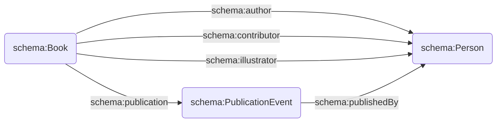

# STCN (subselection)

The scope of the STCN dataset is too wide for our initial aim. Therefore, we select a subset of the STCN dataset using the following steps:

1. Using a CONSTRUCT query in `all-schema.rq`, we request all information on the production process and the actors involved from a particular book. We separate author, contributor, and illustrator as given by the dataset. We only do this for the items that are listed in the Rijksmuseum Library dataset that are linked to a manifestation in the STCN dataset. The output of this can be found in `all-schema.ttl`. 
2. In a second step, we request a mapping from the ECARTICO dataset to both the STCN (i.e. the NTA URIs) and the Rijksmuseum Library dataset (i.e. URIs on `id.rijksmuseum.nl`) using a SELECT query in `all-schema-mapping.rq`. The output of this can be found in `all-schema-mapping.csv`.
3. For persons not entered in ECARTICO, we request a separate mapping from Rijksmuseum Library URI to NTA URI using a SELECT query on the Wikidata endpoint in `wikidata-mpping.rq`. The output of this can be found in `wikidata-mapping.csv`. This helps us in further trimming down the number of distinct person-URIs in the dataset.
4. Finally, we replace all NTA and Rijksmuseum Library person URIs for by their canonical ECARTICO URI. If this mapping is not available, we change Rijksmuseum Library URIs to NTA URIs, and if this mapping is not available, we remove the resource from this dataset. This is done in the script in `mapping.py`. The result of this can be found in `all-schema-ecartico.ttl`.

NB: Querying our Virtuoso endpoint most likely lets you run into a bug that only gives back 10.001 triples. The query in (1) is therefore executed on another (local) triplestore (Stardog) that has the same data loaded. 

## Datasets used
* STCN (version d.d. 2020-11-05)
* Rijksmuseum Library (version 2021-09, this repository)
* ECARTICO (version 2021-10-14)

## Model

The CONSTRUCT query leads to a heavily simplified RDF representation of the data in which the roles of the involved actors are represented as follows:

